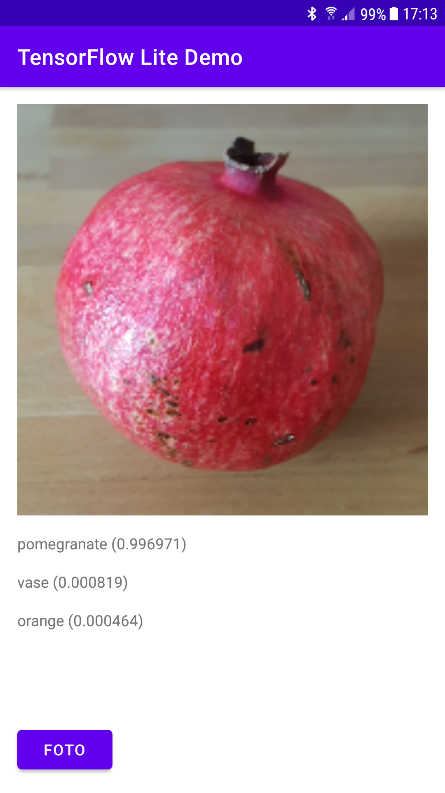

*[Read in English](README.md)*

# TensorFlow Lite Demo

Dies ist eine sehr minimalistische Machine-Learning-Beispiel-App für Android, die die Nutzung der TensorFlow Lite Import-Funktionalität von Android Studio 4.1 demonstriert.

Sie nutzt dafür ein bereits trainiertes auf TensorFlow Lite optimiertes Modell (mobilenet_v1_1.0_160) zur Bildklassifikation, das über den TensorFlow Hub bereitgestellt wird:

https://tfhub.dev/tensorflow/lite-model/mobilenet_v1_1.0_160/1/metadata/1

Diese Model beinhaltet sowohl das TensorFlow Lite Modell als auch die Label-Datei.

Obwohl der Import-Assistent in der Lage ist sowohl Kotlin- als auch Java-Code zu erzeugen, ist dieses Beispiel-Anwendung in Java geschrieben und der relevante Java-Code ist in folgender Datei innerhalb dieses Repository zu finden:

[MainActivity.java](app/src/main/java/com/example/tflitedemo/MainActivity.java)

Die dazugehörige XML-Layout-Definition des UI kann man in dieser Datei finden:

[activity_main.xml](app/src/main/res/layout/activity_main.xml)

## Erste Schritte

Um diese Demo zu erstellen und auszuführen sollte zunächst Android Studio Version 4.1 oder höher installiert werden, das auf der Android-Website heruntergeladen werden kann:

https://developer.android.com/studio

Man kann das Projekt direkt von GitHub in Android Studio importieren indem man die Option "Get from Version Control" auswählt. Nach dem Erstellen und Deployen der App auf ein Android-Gerät kann man ein Foto von einem Alltagsobjekt aufnehmen und die Wahrscheinlichkeit der Top-3-Treffer erhalten.

## Importieren des Modells

In dieser Beispiel-App wurde die neue Import-Funktionalität von Android Studio verwendet um das TensorFlow Lite Modell zu importieren. Der Import-Assistent kann über das Menü "File -> New -> Other -> TensorFlow Lite Model" von Android Studio gestartet werden. Allerdings wurde für das Projekt in diesem Repository das Modell bereits importiert und die Abhängigkeiten erzeugt, so dass dieser Schritt übersprungen werden kann.

## Anforderungen

- Android Studio 4.1 oder höher
- Android Gerät oder Emulator mit API Version 24 oder höher (API 28 ist die Zielversion)
- Für optimale Ergebnisse sollte das Seitenverhältnis der Kamera in den Kameraeinstellungen auf quadratisch gestellt werden.

## Weiterführende Informationen

Eine kurze Einführung in Machine Learning für IoT und Mobile sowie eine detaillierte Beschreibung dieser Beispielanwendung findet man in dem Sonderheft "iX Developer Machine Learning 2020" in dem Artikel "Machine Learning für IoT und Mobile" auf Seite 54: 

https://shop.heise.de/ix-developer-machine-learning-2020/

## Lizenz

Lizensiert unter der Apache Lizenz, Version 2.0
