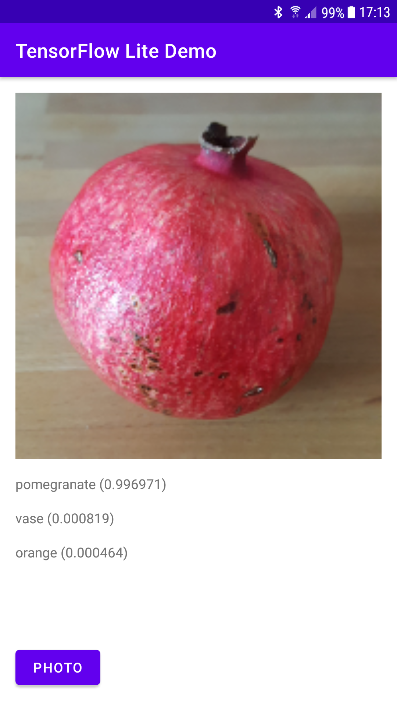

*[Auf Deutsch lesen](README-de.md)*

# TensorFlow Lite Demo

This is a very minimalistic machine learning sample app for Android demonstrating the use of the TensorFlow Lite import capability of Android Studio 4.1.

It uses a pre-trained model (mobilenet_v1_1.0_160) for image classification optimized to work with TensorFlow Lite, which is provided on TensorFlow Hub:

https://tfhub.dev/tensorflow/lite-model/mobilenet_v1_1.0_160/1/metadata/1

This model contains both TensorFlow Lite model metadata and the label file.

Although the import assistant is able to produce Kotlin and Java code, this sample application is written in Java and you can find the relevant Java code in the following file within this repository:

[MainActivity.java](app/src/main/java/com/example/tflitedemo/MainActivity.java)

The corresponding XML layout definition of the UI you can find in this file:

[activity_main.xml](app/src/main/res/layout/activity_main.xml)

## Getting Started

In order to build and run this demo Android Studio version 4.1 or higher should be installed, which can be downloaded from the Android website:

https://developer.android.com/studio

You can import this project directly from GitHub into Android Studio by selecting the option "Get from Version Control". After building and deploying the app to your Android device, you can take a photo of everyday objects and see the probability of the top three matches.

## Import of the Model

In this sample app the new import feature of Android Studio has been used in order to import the TensorFlow Lite model. The import assistant can be started through the menu "File -> New -> Other -> TensorFlow Lite Model" of Android Studio. However, for the project in this repository, the model has already been imported and the dependencies have been created, so that this step can be skipped.

## Requirements

- Android Studio 4.1 or higher
- Android Device or Emulator with API version 24 or higher (API 28 is the target version)
- For best results, the aspect ratio of the camera should be set to square in the camera settings of the phone.

## Further Reading

A brief introduction on machine learning for IoT and mobile and a detailed description of this sample application you can find in the magazine "iX Developer Machine Learning 2020" in the article "Machine Learning für IoT und Mobile" on page 54:

https://shop.heise.de/ix-developer-machine-learning-2020/

## License

Licensed under the Apache License, Version 2.0
